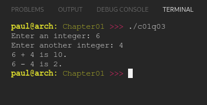

# Chapter 01
## Question 03

### Write a program that asks the user to enter a number, and then enter a second number. The program should tell the user what the result of adding and subtracting the two numbers is.

The output of the program should match the following (assuming inputs of 6 and 4):

```
Enter an integer: 6
Enter another integer: 4
6 + 4 is 10.
6 - 4 is 2.
```

<br>

### ANSWER
**Output**



**Code**

See [c01q03.cpp](./c01q03.cpp)


<br>

### SOLUTION
[@learncpp.com](https://www.learncpp.com/cpp-tutorial/chapter-1-summary-and-quiz#cpp_solution_id_2)