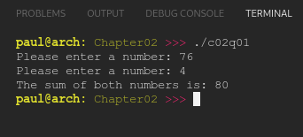

# Chapter 02
## Question 01

### Write a single-file program (named main.cpp) that reads two separate integers from the user, adds them together, and then outputs the answer.

The program should use three functions:

- A function named “readNumber” should be used to get (and return) a single integer from the user.
- A function named “writeAnswer” should be used to output the answer. This function should take a single parameter and have no return value.
- A main() function should be used to glue the above functions together.

 

### ANSWER
**Output**

**Code**

See [c02q01.cpp](./c02q01.cpp)

 

### SOLUTION
[@learncpp.com](https://www.learncpp.com/cpp-tutorial/chapter-2-summary-and-quiz#cpp_solution_id_0)
