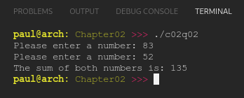

# Chapter 02
## Question 02

### Modify the program you wrote in exercise #1 so that readNumber() and writeAnswer() live in a separate file called “io.cpp”. Use a forward declaration to access them from main().

 

### ANSWER
**Output**

**Code**

See [c02q02-main.cpp](./c02q02-main.cpp) & [c02q02-io.cpp](./c02q02-io.cpp)

 

### SOLUTION
[@learncpp.com](https://www.learncpp.com/cpp-tutorial/chapter-2-summary-and-quiz#cpp_solution_id_1)