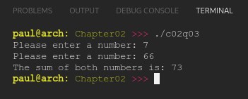

# Chapter 02
## Question 03

### Modify the program you wrote in #2 so that it uses a header file (named io.h) to access the functions instead of using forward declarations directly in your code (.cpp) files. Make sure your header file uses header guards.

 

### ANSWER
**Output**

**Code**

See [c02q03-main.cpp](./c02q03-main.cpp), [c02q03-io.cpp](./c02q03-io.cpp) & [c02q03-io.h](./c02q03-io.h)

 

### SOLUTION
[@learncpp.com](https://www.learncpp.com/cpp-tutorial/chapter-2-summary-and-quiz#cpp_solution_id_2)

**Notes**

Despite the fact my code compiled, I should have used `#include "c02q03-io.h"` in both cpp files but `#include <stdio>` in only the file that used it directly (c02a03-io.cpp).

We explicitly #include all headers in each file to make sure it is definitely available where it is needed, and use header guards so that it only loads once.