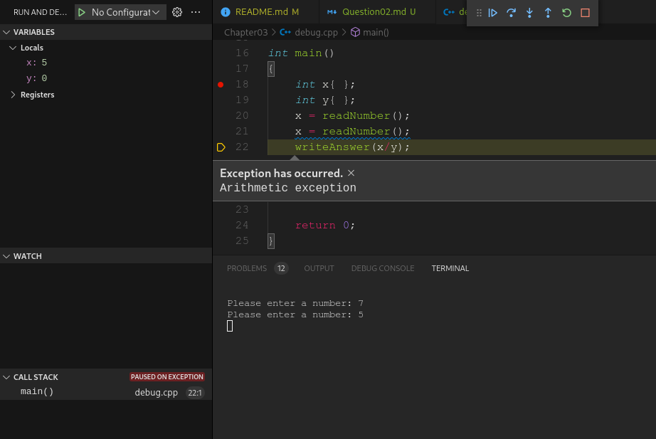

# Chapter 03
## Question 02

### The following program is supposed to divide two numbers, but doesn’t work correctly. Use the integrated debugger to step through this program. For inputs, enter 8 and 4. Based on the information you learn, fix the following program:

<br>

```cpp
#include <iostream>

int readNumber()
{
	std::cout << "Please enter a number: ";
	int x {};
	std::cin >> x;
	return x;
}

void writeAnswer(int x)
{
	std::cout << "The quotient is: " << x << '\n';
}

int main()
{
	int x{ };
	int y{ };
	x = readNumber();
	x = readNumber();
	writeAnswer(x/y);

	return 0;
}
```

<br>

### ANSWER
x is assigned two different values and y is never assigned a value. The solution is to change the second `x = readNumber();` to `y = readNumber()` (either actually, but only one, and the second makes slightly more sense, following alphabetical and variable initialisation order).

<br>

```cpp
#include <iostream>

int readNumber()
{
	std::cout << "Please enter a number: ";
	int x {};
	std::cin >> x;
	return x;
}

void writeAnswer(int x)
{
	std::cout << "The quotient is: " << x << '\n';
}

int main()
{
	int x{ };
	int y{ };
	x = readNumber();
	y = readNumber();
	writeAnswer(x/y);

	return 0;
}
```

<br>

Again, I saw the problem as soon as the debugger reached the line in question. However, it also threw a very obvious and easy to see error.

<br>



<br>

### SOLUTION
[@learncpp.com](https://www.learncpp.com/cpp-tutorial/chapter-3-summary-and-quiz#cpp_solution_id_1)