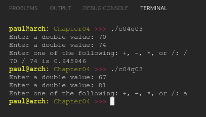

# Chapter 04
## Question 03

### Write the following program: The user is asked to enter 2 floating point numbers (use doubles). The user is then asked to enter one of the following mathematical symbols: +, -, *, or /. The program computes the answer on the two numbers the user entered and prints the results. If the user enters an invalid symbol, the program should print nothing. Example of program:

<br>

```
Enter a double value: 6.2
Enter a double value: 5
Enter one of the following: +, -, *, or /: *
6.2 * 5 is 31
```

<br>

### ANSWER
**Output**



**Code**

See [c04q03.cpp](./c04q03.cpp)


<br>

### SOLUTION
[@learncpp.com](https://www.learncpp.com/cpp-tutorial/chapter-4-summary-and-quiz#cpp_solution_id_9)