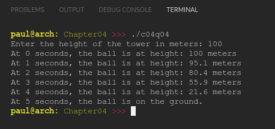

# Chapter 04
## Question 04

### Write a short program to simulate a ball being dropped off of a tower. To start, the user should be asked for the height of the tower in meters. Assume normal gravity (9.8 m/s<sup>2</sup>), and that the ball has no initial velocity (the ball is not moving to start). Have the program output the height of the ball above the ground after 0, 1, 2, 3, 4, and 5 seconds. The ball should not go underneath the ground (height 0).

### Use a function to calculate the height of the ball after x seconds. The function can calculate how far the ball has fallen after x seconds using the following formula: distance fallen = gravity_constant * x_seconds<sup>2</sup> / 2

### Desired output:

<br>

```
Enter the height of the tower in meters: 100
At 0 seconds, the ball is at height: 100 meters
At 1 seconds, the ball is at height: 95.1 meters
At 2 seconds, the ball is at height: 80.4 meters
At 3 seconds, the ball is at height: 55.9 meters
At 4 seconds, the ball is at height: 21.6 meters
At 5 seconds, the ball is on the ground.
```

<br>

### ANSWER
**Output**



**Code**

See [c04q04.cpp](./c04q04.cpp)


<br>

### SOLUTION
[@learncpp.com](https://www.learncpp.com/cpp-tutorial/chapter-4-summary-and-quiz#cpp_solution_id_10)