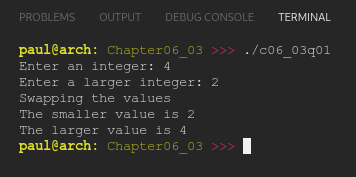

# Chapter 06.03
## Question 01

### Write a program that asks the user to enter two integers, one named smaller, the other named larger. If the user enters a smaller value for the second integer, use a block and a temporary variable to swap the smaller and larger values. Then print the values of the smaller and larger variables. Add comments to your code indicating where each variable dies. Note: When you print the values, smaller should hold the smaller input and larger the larger input, no matter which order they were entered in.

### The program output should match the following:

<br>

```
Enter an integer: 4
Enter a larger integer: 2
Swapping the values
The smaller value is 2
The larger value is 4
```

<br>

### ANSWER
**Output**



**Code**

See [c06_03q01.cpp](./c06_03q01.cpp)


<br>

### SOLUTION
[@learncpp.com](https://www.learncpp.com/cpp-tutorial/local-variables#cpp_solution_id_0)