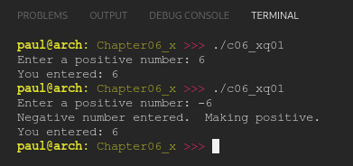

# Chapter 06.x
## Question 01

### Fix the following program:

<br>

```cpp
#include <iostream>

int main()
{
	std::cout << "Enter a positive number: ";
	int num{};
	std::cin >> num;


	if (num < 0)
		std::cout << "Negative number entered.  Making positive.\n";
		num = -num;

	std::cout << "You entered: " << num;

	return 0;
}
```

<br>

### ANSWER

- Placed both lines following `if (num < 0)` into a single block. Identified, using linter.
- Addition of newline character after `std::cout << "You entered: " << num;`. Identified during execution.

**Output**



**Code**

See [c06_Xq01.cpp](./c06_Xq01.cpp)

<br>

### SOLUTION
[@learncpp.com](https://www.learncpp.com/cpp-tutorial/chapter-6-summary-and-quiz#cpp_solution_id_0)