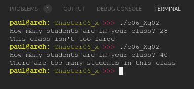

# Chapter 06.X
## Question 02

### Write a file named constants.h that makes the following program run. If your compiler is C++17 capable, use inline constexpr variables. Otherwise, use normal constexpr variables. max_class_size should be 35.

<br>

```cpp
#include <iostream>
#include "constants.h"

int main()
{
	std::cout << "How many students are in your class? ";
	int students{};
	std::cin >> students;


	if (students > constants::max_class_size)
		std::cout << "There are too many students in this class";
	else
		std::cout << "This class isn't too large";

	return 0;
}
```

<br>

### ANSWER

**Output**



**Code**

See [c06_Xq01.cpp](./c06_Xq02.cpp) & [c06_Xq01_constants.h](c06_Xq02_constants.h)

<br>

### SOLUTION
[@learncpp.com](https://www.learncpp.com/cpp-tutorial/chapter-6-summary-and-quiz#cpp_solution_id_1)