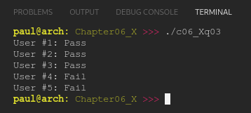

# Chapter 06.X
## Question 03

### Complete the following program by writing the passOrFail() function, which should return true for the first 3 calls, and false thereafter. Do this without modifying the main() function.

<br>

```cpp
#include <iostream>

int main()
{
	std::cout << "User #1: " << (passOrFail() ? "Pass\n" : "Fail\n");
	std::cout << "User #2: " << (passOrFail() ? "Pass\n" : "Fail\n");
	std::cout << "User #3: " << (passOrFail() ? "Pass\n" : "Fail\n");
	std::cout << "User #4: " << (passOrFail() ? "Pass\n" : "Fail\n");
	std::cout << "User #5: " << (passOrFail() ? "Pass\n" : "Fail\n");

	return 0;
}
```

### The program should produce the following output:

```
User #1: Pass
User #2: Pass
User #3: Pass
User #4: Fail
User #5: Fail
```

<br>

### ANSWER

**Output**



**Code**

See [c06_Xq01.cpp](./c06_Xq03.cpp)

<br>

### SOLUTION
[@learncpp.com](https://www.learncpp.com/cpp-tutorial/chapter-6-summary-and-quiz#cpp_solution_id_2)