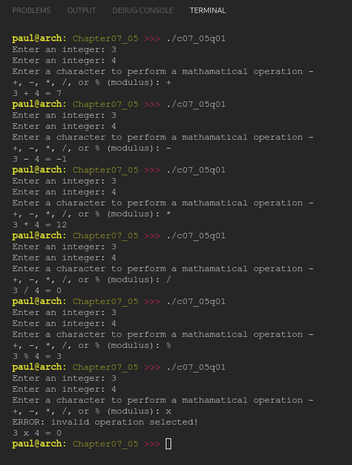

# Chapter 07.05
## Question 01

### Write a function called calculate() that takes two integers and a char representing one of the following mathematical operations: +, -, *, /, or % (modulus). Use a switch statement to perform the appropriate mathematical operation on the integers, and return the result. If an invalid operator is passed into the function, the function should print an error. For the division operator, do an integer division.

 

### ANSWER
**Output**

**Code**

See [c07_05q01.cpp](./c07_05q01.cpp)

 

### SOLUTION
[@learncpp.com](https://www.learncpp.com/cpp-tutorial/switch-fallthrough-and-scoping#cpp_solution_id_0)