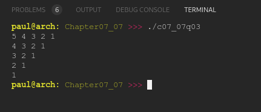

# Chapter 07.07
## Question 03

### Invert the nested loops example so it prints the following:

```cpp
5 4 3 2 1
4 3 2 1
3 2 1
2 1
1
```

<br>

### ANSWER

**Output**



**Code**

See [c07_07q03.cpp](./c07_07q03.cpp)

<br>

### SOLUTION
[@learncpp.com](https://www.learncpp.com/cpp-tutorial/intro-to-loops-and-while-statements#cpp_solution_id_2)