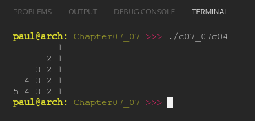

# Chapter 07.07
## Question 04

### Now make the numbers print like this:

```cpp
        1
      2 1
    3 2 1
  4 3 2 1
5 4 3 2 1
```

<br>

### ANSWER

**Output**



**Code**

See [c07_07q04.cpp](./c07_07q04.cpp)

<br>

### SOLUTION
[@learncpp.com](https://www.learncpp.com/cpp-tutorial/intro-to-loops-and-while-statements#cpp_solution_id_3)