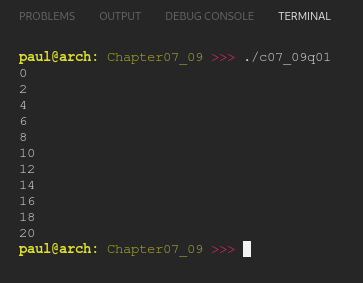

# Chapter 07.09
## Question 01

### Write a for loop that prints every even number from 0 to 20.

 

### ANSWER

**Output**

**Code**

See [c07_09q01.cpp](./c07_09q01.cpp)

 

### SOLUTION
[@learncpp.com](https://www.learncpp.com/cpp-tutorial/for-statements#cpp_solution_id_0)