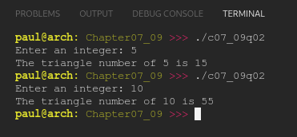

# Chapter 07.09
## Question 02

### Write a function named sumTo() that takes an integer parameter named value, and returns the sum of all the numbers from 1 to value.

### For example, sumTo(5) should return 15, which is 1 + 2 + 3 + 4 + 5.

 

### ANSWER

**Output**

**Code**

See [c07_09q02.cpp](./c07_09q02.cpp)

 

### SOLUTION
[@learncpp.com](https://www.learncpp.com/cpp-tutorial/for-statements#cpp_solution_id_1)