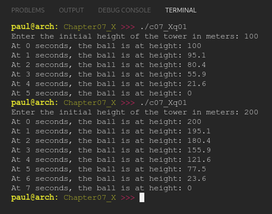

# Chapter 07.X
## Question 01

### In the chapter 4 comprehensive quiz, we wrote a program to simulate a ball falling off of a tower. Because we didn’t have loops yet, the ball could only fall for 5 seconds.

### Take the program below and modify it so that the ball falls for as many seconds as needed until it reaches the ground.

### In constants.h:

```cpp
#ifndef CONSTANTS_H
#define CONSTANTS_H

namespace myConstants
{
    inline constexpr double gravity { 9.8 }; // in meters/second squared
}
#endif
```

### In your main code file:

```cpp
#include <iostream>
#include "constants.h"

double calculateHeight(double initialHeight, int seconds)
{
    double distanceFallen { myConstants::gravity * seconds * seconds / 2 };
    double heightNow { initialHeight - distanceFallen };

    // Check whether we've gone under the ground
    // If so, set the height to ground-level
    if (heightNow < 0.0)
        return 0.0;
    else
        return heightNow;
}

void calculateAndPrintHeight(double initialHeight, int time)
{
    std::cout << "At " << time << " seconds, the ball is at height: " << calculateHeight(initialHeight, time) << "\n";
}

int main()
{
    std::cout << "Enter the initial height of the tower in meters: ";
    double initialHeight {};
    std::cin >> initialHeight;

    calculateAndPrintHeight(initialHeight, 0);
    calculateAndPrintHeight(initialHeight, 1);
    calculateAndPrintHeight(initialHeight, 2);
    calculateAndPrintHeight(initialHeight, 3);
    calculateAndPrintHeight(initialHeight, 4);
    calculateAndPrintHeight(initialHeight, 5);

    return 0;
}
```

<br>

### ANSWER

**Output**



**Code**

See [c07_Xq01.cpp](./c07_Xq01.cpp) & [c07_Xq01_constants.h](./c07_Xq01_constants.h)

<br>

### SOLUTION
[@learncpp.com](https://www.learncpp.com/cpp-tutorial/chapter-7-comprehensive-quiz/#cpp_solution_id_0)