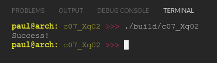

# Chapter 07.X
## Question 02

### A prime number is a natural number greater than 1 that is evenly divisible (with no remainder) only by 1 and itself. Complete the following program by writing the isPrime() function using a for-loop. When successful, the program will print “Success!”.

<br/>

```cpp
#include <iostream>
#include <cassert>

bool isPrime(int x)
{
    // write this function using a for loop
}

int main()
{
    assert(!isPrime(0));
    assert(!isPrime(1));
    assert(isPrime(2));
    assert(isPrime(3));
    assert(!isPrime(4));
    assert(isPrime(5));
    assert(isPrime(7));
    assert(!isPrime(9));
    assert(isPrime(11));
    assert(isPrime(13));
    assert(!isPrime(15));
    assert(!isPrime(16));
    assert(isPrime(17));
    assert(isPrime(19));
    assert(isPrime(97));
    assert(!isPrime(99));
    assert(isPrime(13417));

    std::cout << "Success!\n";

    return 0;
}
```

<br>

### ANSWER

**Output**



**Code**

See [c07_Xq01.cpp](./c07_Xq01.cpp) & [c07_Xq01_constants.h](./c07_Xq01_constants.h)

**!!TBD - refactor above link!!**

<br>

### SOLUTION
[@learncpp.com](https://www.learncpp.com/cpp-tutorial/chapter-7-comprehensive-quiz/#cpp_solution_id_1)