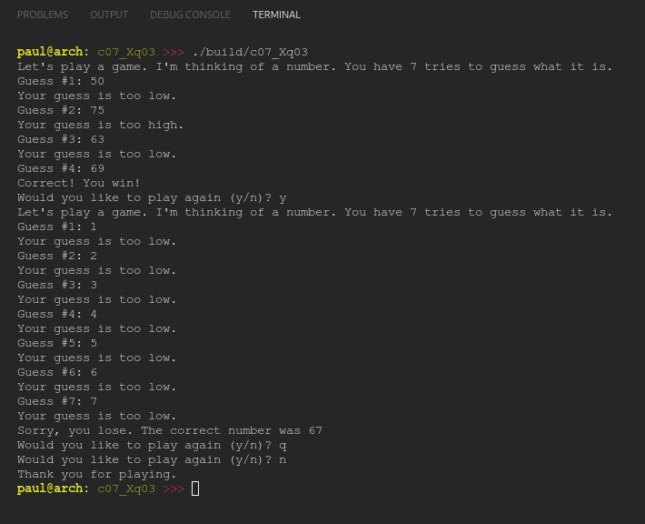

# Chapter 07.X
## Question 03

### Implement a game of hi-lo. First, your program should pick a random integer between 1 and 100. The user is given 7 tries to guess the number.

### If the user does not guess the correct number, the program should tell them whether they guessed too high or too low. If the user guesses the right number, the program should tell them they won. If they run out of guesses, the program should tell them they lost, and what the correct number is. At the end of the game, the user should be asked if they want to play again. If the user doesn’t enter ‘y’ or ‘n’, ask them again.

### For this quiz, assume the user enters a valid number. Use a Mersenne Twister PRNG, and seed it using a std::seed_seq with 8 results from std::random_device.

### Here’s what your output should look like:

<br/>

```
Let's play a game. I'm thinking of a number. You have 7 tries to guess what it is.
Guess #1: 64
Your guess is too high.
Guess #2: 32
Your guess is too low.
Guess #3: 54
Your guess is too high.
Guess #4: 51
Correct! You win!
Would you like to play again (y/n)? y
Let's play a game. I'm thinking of a number. You have 7 tries to guess what it is.
Guess #1: 64
Your guess is too high.
Guess #2: 32
Your guess is too low.
Guess #3: 54
Your guess is too high.
Guess #4: 51
Your guess is too high.
Guess #5: 36
Your guess is too low.
Guess #6: 45
Your guess is too low.
Guess #7: 48
Your guess is too low.
Sorry, you lose. The correct number was 49.
Would you like to play again (y/n)? q
Would you like to play again (y/n)? n
Thank you for playing.
```

<br>

### ANSWER

**Output**



**Code**

See project [c07_Xq03](./c07_Xq03/)

<br>

### SOLUTION
[@learncpp.com](https://www.learncpp.com/cpp-tutorial/chapter-7-comprehensive-quiz/#cpp_solution_id_2)