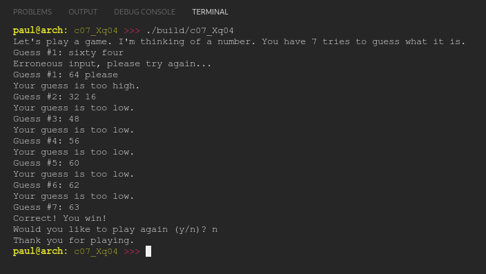

# Chapter 07.X
## Question 04

### Update [c07_Xq03](./c07_Xq03/) to handle invalid input (e.g. ‘x’) or valid input with extraneous characters (e.g. “43x”) when the user is guessing a number.

 

### ANSWER

**Output**

**Code**

See project [c07_Xq04](./c07_Xq04/)

 

### SOLUTION
[@learncpp.com](https://www.learncpp.com/cpp-tutorial/chapter-7-comprehensive-quiz/#cpp_solution_id_2)